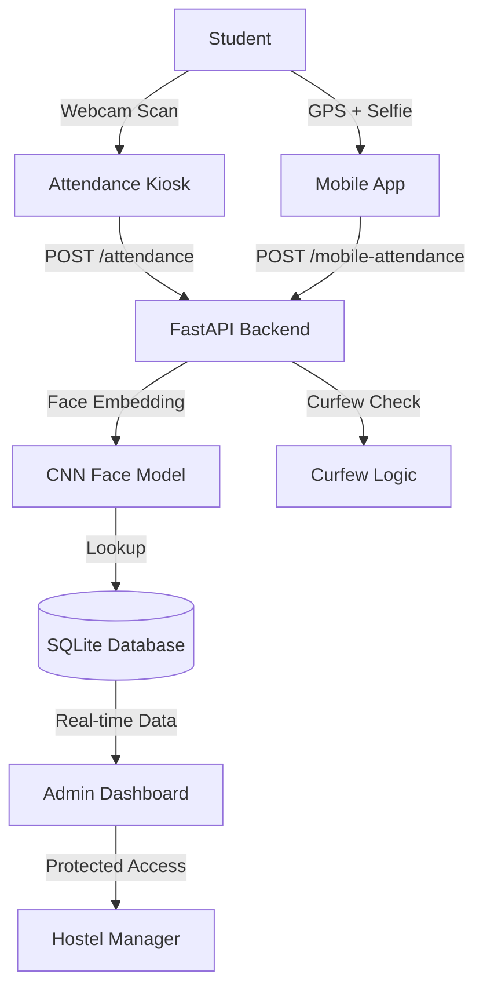

# Smart Hostel Curfew Attendance & Alert System

A high-performance, deep learning-powered attendance system designed for university hostels (e.g., NUST H-12 Campus). This project combines facial recognition, GPS geofencing, and automated curfew monitoring into a unified security ecosystem.

---

## 🌟 Core Features

### 1. Deep Learning Facial Verification
*   **Technology**: Uses a Convolutional Neural Network (CNN) to extract 128-dimensional facial embeddings.
*   **Accuracy**: Implements similarity learning with a tuned Euclidean distance threshold (0.6) to differentiate between registered students and unauthorized individuals.
*   **Real-time Processing**: Optimized for low-latency verification in both the Kiosk and Mobile modes.

### 2. Dual-Mode Attendance
*   **Floor Kiosk**: A dedicated station using the webcam for high-speed, contactless attendance marking at hostel entrances.
*   **Mobile GPS Check-in**: Allows students to check in via their smartphones. It uses the **Haversine Formula** to verify that the student is within the physical vicinity of their assigned hostel (e.g., Amna, Ayesha, Khadija, or Zainab).

### 3. Automated Curfew Intelligence
*   **Dynamic Windows**: Attendance is only recorded during configurable curfew windows.
*   **Automated Absentee Logs**: Once the curfew window closes, the system automatically cross-references the student database to flag anyone who hasn't checked in.
*   **Security Logging**: Every attempt—whether successful, unrecognized, or outside the curfew window—is logged for administrative review.

### 4. Admin Command Center (Dashboard)
*   **Real-time Stats**: Track total strength, present count, and absentees at a glance.
*   **System Alerts**: Instant notification of "Unknown Identity" attempts or unauthorized entries.
*   **Secured Management**: Protecting student data with a session-based Admin Authentication layer.

---

## 🛠️ Technology Stack

### Backend (The "Brain")
*   **FastAPI**: A high-performance Python framework for handling concurrent requests.
*   **SQLAlchemy**: ORM for robust database management and relationship mapping.
*   **SQLite**: Lightweight, portable relational database.
*   **Dependency Injection**: Optimized connection pooling to prevent database leaks during high-traffic periods (Kiosk usage).

### Frontend (The "Interface")
*   **Vanilla HTML5/CSS3**: Glassmorphic UI design for a premium, modern aesthetic.
*   **JavaScript (ES6)**: Handles real-time video streaming, GPS API integration, and asynchronous backend communication.
*   **FontAwesome**: Professional iconography for an enterprise-grade user experience.

---

## 📂 System Architecture



---

## 🚀 Getting Started

### 1. Environment Setup
```bash
# Install dependencies
pip install -r requirements.txt
```

### 2. Launch the Backend
```bash
uvicorn backend.app.main:app --reload --host 0.0.0.0 --port 8000
```

### 3. Launch the Frontend
```bash
# Navigate to frontend folder and run a simple server
python -m http.server 3000
```

### 4. Admin Credentials
The system comes pre-seeded with a default administrator account for the first run:
*   **Username**: `admin`
*   **Password**: `admin123`

---

## 🏛️ Project Structure
*   `backend/app/routes.py`: Core API logic and security dependencies.
*   `backend/models/`: Database schemas and Deep Learning face verification logic.
*   `frontend/`: Premium glassmorphic interface files.
*   `database.db`: Persistent storage for students, admins, and attendance logs.

---

## ⚖️ License
Developed for academic purposes at NUST H-12 Campus. All rights reserved.